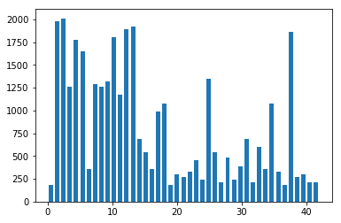

# Self-Driving Car Engineer Nanodegree

## Deep Learning

## Project: Build a Traffic Sign Recognition Classifier

---
## Step 0: Load The Data


```python
# Load pickled data
import pickle

# TODO: Fill this in based on where you saved the training and testing data

training_file = "train.p"
validation_file= "valid.p"
testing_file = "test.p"

with open(training_file, mode='rb') as f:
    train = pickle.load(f)
with open(validation_file, mode='rb') as f:
    valid = pickle.load(f)
with open(testing_file, mode='rb') as f:
    test = pickle.load(f)
    
X_train, y_train = train['features'], train['labels']
X_validation, y_validation = valid['features'], valid['labels']
X_test, y_test = test['features'], test['labels']
print("X_train shape:", X_train.shape)
print("y_train shape:", y_train.shape)
print("X_validation shape:", X_validation.shape)
print("y_validation shape:", y_validation.shape)
print("X_test shape:", X_test.shape)
print("y_test shape:", y_test.shape)
```

    X_train shape: (34799, 32, 32, 3)
    y_train shape: (34799,)
    X_validation shape: (4410, 32, 32, 3)
    y_validation shape: (4410,)
    X_test shape: (12630, 32, 32, 3)
    y_test shape: (12630,)


---

## Step 1: Dataset Summary & Exploration


### Provide a Basic Summary of the Data Set Using Python, Numpy and/or Pandas


```python
### Replace each question mark with the appropriate value. 
### Use python, pandas or numpy methods rather than hard coding the results
import numpy as np

# TODO: Number of training examples
n_train = len(train['features'])

# TODO: Number of validation examples
n_validation = len(valid['features'])

# TODO: Number of testing examples.
n_test = len(test['features'])

# TODO: What's the shape of an traffic sign image?
image_shape = X_train[0].shape

# TODO: How many unique classes/labels there are in the dataset.
n_classes = len(np.unique(y_train))

print("Number of training examples =", n_train)
print("Number of testing examples =", n_test)
print("Image data shape =", image_shape)
print("Number of classes =", n_classes)
```

    Number of training examples = 34799
    Number of testing examples = 12630
    Image data shape = (32, 32, 3)
    Number of classes = 43


### Include an exploratory visualization of the dataset


```python
### Data exploration visualization code goes here.
### F eel free to use as many code cells as needed.
import random
import matplotlib.pyplot as plt
# Visualizations will be shown in the notebook.
%matplotlib inline

# index = random.randint(0, len(X_train))
# image = X_train[index].squeeze()

# plt.figure(figsize=(1,1))
# plt.imshow(image)
# print(y_train[index])


# show image of 10 random data points
fig, axs = plt.subplots(2,5, figsize=(15, 6))
fig.subplots_adjust(hspace = .2, wspace=.001)
axs = axs.ravel()
for i in range(10):
    index = random.randint(0, len(X_train))
    image = X_train[index]
    axs[i].axis('off')
    axs[i].imshow(image)
    axs[i].set_title(y_train[index])

```


```python
# histogram of label frequency
hist, bins = np.histogram(y_train, bins=n_classes)
width = 0.7 * (bins[1] - bins[0])
center = (bins[:-1] + bins[1:]) / 2
plt.bar(center, hist, align='center', width=width)
plt.show()
```





----

## Step 2: Design and Test a Model Architecture

Here I have first tried out with the original LeNet implementaion as discussed in the class and then moved on to implement LeNet2 which is basically what the paper referred to has implemented.
### Pre-process the Data Set (normalization, grayscale, etc.)

Pre Processing invlolved converting rgb to grayscale and then normalising the image. The dataset was augmented using the random_translate, random_scale, random_warp, and random_brightness functions implemented below

```python
### Preprocess the data here. It is required to normalize the data. Other preprocessing steps could include 
### converting to grayscale, etc.
### Feel free to use as many code cells as needed.


# Convert to grayscale
X_train_rgb = X_train
X_train_gry = np.sum(X_train/3, axis=3, keepdims=True)

X_test_rgb = X_test
X_test_gry = np.sum(X_test/3, axis=3, keepdims=True)

X_validation_rgb = X_validation
X_validation_gry = np.sum(X_validation/3, axis=3, keepdims=True)

print('RGB shape:', X_train_rgb.shape)
print('Grayscale shape:', X_train_gry.shape)

```

    RGB shape: (34799, 32, 32, 3)
    Grayscale shape: (34799, 32, 32, 1)


```python
X_train = X_train_gry
X_validation = X_validation_gry
X_test = X_test_gry

```


```python
# Visualize rgb vs grayscale
n_rows = 8
n_cols = 10
offset = 9000
fig, axs = plt.subplots(n_rows,n_cols, figsize=(18, 14))
fig.subplots_adjust(hspace = .1, wspace=.001)
axs = axs.ravel()
for j in range(0,n_rows,2):
    for i in range(n_cols):
        index = i + j*n_cols
        image = X_train_rgb[index + offset]
        axs[index].axis('off')
        axs[index].imshow(image)
    for i in range(n_cols):
        index = i + j*n_cols + n_cols 
        image = X_train_gry[index + offset ].squeeze() - n_cols
        axs[index].axis('off')
        axs[index].imshow(image, cmap='gray')
```


```python
print(y_train[0:500])
```

    [41 41 41 41 41 41 41 41 41 41 41 41 41 41 41 41 41 41 41 41 41 41 41 41 41
     41 41 41 41 41 41 41 41 41 41 41 41 41 41 41 41 41 41 41 41 41 41 41 41 41
     41 41 41 41 41 41 41 41 41 41 41 41 41 41 41 41 41 41 41 41 41 41 41 41 41
     41 41 41 41 41 41 41 41 41 41 41 41 41 41 41 41 41 41 41 41 41 41 41 41 41
     41 41 41 41 41 41 41 41 41 41 41 41 41 41 41 41 41 41 41 41 41 41 41 41 41
     41 41 41 41 41 41 41 41 41 41 41 41 41 41 41 41 41 41 41 41 41 41 41 41 41
     41 41 41 41 41 41 41 41 41 41 41 41 41 41 41 41 41 41 41 41 41 41 41 41 41
     41 41 41 41 41 41 41 41 41 41 41 41 41 41 41 41 41 41 41 41 41 41 41 41 41
     41 41 41 41 41 41 41 41 41 41 31 31 31 31 31 31 31 31 31 31 31 31 31 31 31
     31 31 31 31 31 31 31 31 31 31 31 31 31 31 31 31 31 31 31 31 31 31 31 31 31
     31 31 31 31 31 31 31 31 31 31 31 31 31 31 31 31 31 31 31 31 31 31 31 31 31
     31 31 31 31 31 31 31 31 31 31 31 31 31 31 31 31 31 31 31 31 31 31 31 31 31
     31 31 31 31 31 31 31 31 31 31 31 31 31 31 31 31 31 31 31 31 31 31 31 31 31
     31 31 31 31 31 31 31 31 31 31 31 31 31 31 31 31 31 31 31 31 31 31 31 31 31
     31 31 31 31 31 31 31 31 31 31 31 31 31 31 31 31 31 31 31 31 31 31 31 31 31
     31 31 31 31 31 31 31 31 31 31 31 31 31 31 31 31 31 31 31 31 31 31 31 31 31
     31 31 31 31 31 31 31 31 31 31 31 31 31 31 31 31 31 31 31 31 31 31 31 31 31
     31 31 31 31 31 31 31 31 31 31 31 31 31 31 31 31 31 31 31 31 31 31 31 31 31
     31 31 31 31 31 31 31 31 31 31 31 31 31 31 31 31 31 31 31 31 31 31 31 31 31
     31 31 31 31 31 31 31 31 31 31 31 31 31 31 31 31 31 31 31 31 31 31 31 31 31]


```python
print(np.mean(X_train))
print(np.mean(X_test))
```

    82.677589037
    82.1484603612


```python
## Normalize the train and test datasets to (-1,1)
X_train_normalized = (X_train - 128)/128 
X_test_normalized = (X_test - 128)/128
X_validation_normalized = (X_validation - 128) / 128

print(np.mean(X_train_normalized))
print(np.mean(X_test_normalized))
```

    -0.354081335648
    -0.358215153428


```python
#functions for augmenting the dataset: random_translate, random_scale, random_warp, and random_brightness

import cv2

def random_translate(img):
    rows,cols,_ = img.shape
    
    # allow translation up to px pixels in x and y directions
    px = 2
    dx,dy = np.random.randint(-px,px,2)

    M = np.float32([[1,0,dx],[0,1,dy]])
    dst = cv2.warpAffine(img,M,(cols,rows))
    
    dst = dst[:,:,np.newaxis]
    
    return dst

test_img = X_train_normalized[22222]

test_dst = random_translate(test_img)

fig, axs = plt.subplots(1,2, figsize=(10, 3))

axs[0].axis('off')
axs[0].imshow(test_img.squeeze(), cmap='gray')
axs[0].set_title('original')

axs[1].axis('off')
axs[1].imshow(test_dst.squeeze(), cmap='gray')
axs[1].set_title('translated')

print('shape in/out:', test_img.shape, test_dst.shape)
```

    shape in/out: (32, 32, 1) (32, 32, 1)


```python
def random_scaling(img):   
    rows,cols,_ = img.shape

    # transform limits
    px = np.random.randint(-2,2)

    # ending locations
    pts1 = np.float32([[px,px],[rows-px,px],[px,cols-px],[rows-px,cols-px]])

    # starting locations (4 corners)
    pts2 = np.float32([[0,0],[rows,0],[0,cols],[rows,cols]])

    M = cv2.getPerspectiveTransform(pts1,pts2)

    dst = cv2.warpPerspective(img,M,(rows,cols))
    
    dst = dst[:,:,np.newaxis]
    
    return dst

test_dst = random_scaling(test_img)
    
fig, axs = plt.subplots(1,2, figsize=(10, 3))

axs[0].axis('off')
axs[0].imshow(test_img.squeeze(), cmap='gray')
axs[0].set_title('original')

axs[1].axis('off')
axs[1].imshow(test_dst.squeeze(), cmap='gray')
axs[1].set_title('scaled')

print('shape in/out:', test_img.shape, test_dst.shape)
```

    shape in/out: (32, 32, 1) (32, 32, 1)


```python
def random_warp(img):
    
    rows,cols,_ = img.shape

    # random scaling coefficients
    rndx = np.random.rand(3) - 0.5
    rndx *= cols * 0.06   # this coefficient determines the degree of warping
    rndy = np.random.rand(3) - 0.5
    rndy *= rows * 0.06

    # 3 starting points for transform, 1/4 way from edges
    x1 = cols/4
    x2 = 3*cols/4
    y1 = rows/4
    y2 = 3*rows/4

    pts1 = np.float32([[y1,x1],
                       [y2,x1],
                       [y1,x2]])
    pts2 = np.float32([[y1+rndy[0],x1+rndx[0]],
                       [y2+rndy[1],x1+rndx[1]],
                       [y1+rndy[2],x2+rndx[2]]])

    M = cv2.getAffineTransform(pts1,pts2)

    dst = cv2.warpAffine(img,M,(cols,rows))
    
    dst = dst[:,:,np.newaxis]
    
    return dst

test_dst = random_warp(test_img)

fig, axs = plt.subplots(1,2, figsize=(10, 3))

axs[0].axis('off')
axs[0].imshow(test_img.squeeze(), cmap='gray')
axs[0].set_title('original')

axs[1].axis('off')
axs[1].imshow(test_dst.squeeze(), cmap='gray')
axs[1].set_title('warped')

print('shape in/out:', test_img.shape, test_dst.shape)
```

    shape in/out: (32, 32, 1) (32, 32, 1)


```python
def random_brightness(img):
    shifted = img + 1.0   # shift to (0,2) range
    img_max_value = max(shifted.flatten())
    max_coef = 2.0/img_max_value
    min_coef = max_coef - 0.1
    coef = np.random.uniform(min_coef, max_coef)
    dst = shifted * coef - 1.0
    return dst

test_dst = random_brightness(test_img)

fig, axs = plt.subplots(1,2, figsize=(10, 3))

axs[0].axis('off')
axs[0].imshow(test_img.squeeze(), cmap='gray')
axs[0].set_title('original')

axs[1].axis('off')
axs[1].imshow(test_dst.squeeze(), cmap='gray')
axs[1].set_title('brightness adjusted')

print('shape in/out:', test_img.shape, test_dst.shape)
```

    shape in/out: (32, 32, 1) (32, 32, 1)


```python
print('X, y shapes:', X_train_normalized.shape, y_train.shape)

input_indices = []
output_indices = []

for class_n in range(n_classes):
    print(class_n, ': ', end='')
    class_indices = np.where(y_train == class_n)
    #print (class_indices)
    n_samples = len(class_indices[0])
    if n_samples < 1000:
        for i in range(1000 - n_samples):
            input_indices.append(class_indices[0][i%n_samples])
            output_indices.append(X_train_normalized.shape[0])
            new_img = X_train_normalized[class_indices[0][i % n_samples]]
            new_img = random_translate(random_scaling(random_warp(random_brightness(new_img))))
            X_train_normalized = np.concatenate((X_train_normalized, [new_img]), axis=0)
            y_train = np.concatenate((y_train, [class_n]), axis=0)
            if i % 50 == 0:
                print('|', end='')
            elif i % 10 == 0:
                print('-',end='')
    print('')
            
print('X, y shapes:', X_train_normalized.shape, y_train.shape)
```

    X, y shapes: (34799, 32, 32, 1) (34799,)
    0 : |----|----|----|----|----|----|----|----|----|----|----|----|----|----|----|----|-
    1 : 
    2 : 
    3 : 
    4 : 
    5 : 
    6 : |----|----|----|----|----|----|----|----|----|----|----|----|---
    7 : 
    8 : 
    9 : 
    10 : 
    11 : 
    12 : 
    13 : 
    14 : |----|----|----|----|----|----|
    15 : |----|----|----|----|----|----|----|----|----|
    16 : |----|----|----|----|----|----|----|----|----|----|----|----|---
    17 : |
    18 : 
    19 : |----|----|----|----|----|----|----|----|----|----|----|----|----|----|----|----|-
    20 : |----|----|----|----|----|----|----|----|----|----|----|----|----|----
    21 : |----|----|----|----|----|----|----|----|----|----|----|----|----|----|--
    22 : |----|----|----|----|----|----|----|----|----|----|----|----|----|-
    23 : |----|----|----|----|----|----|----|----|----|----|----
    24 : |----|----|----|----|----|----|----|----|----|----|----|----|----|----|----|
    25 : 
    26 : |----|----|----|----|----|----|----|----|----|
    27 : |----|----|----|----|----|----|----|----|----|----|----|----|----|----|----|---
    28 : |----|----|----|----|----|----|----|----|----|----|-
    29 : |----|----|----|----|----|----|----|----|----|----|----|----|----|----|----|
    30 : |----|----|----|----|----|----|----|----|----|----|----|----|
    31 : |----|----|----|----|----|----|
    32 : |----|----|----|----|----|----|----|----|----|----|----|----|----|----|----|---
    33 : |----|----|----|----|----|----|----|----|
    34 : |----|----|----|----|----|----|----|----|----|----|----|----|---
    35 : 
    36 : |----|----|----|----|----|----|----|----|----|----|----|----|----|-
    37 : |----|----|----|----|----|----|----|----|----|----|----|----|----|----|----|----|-
    38 : 
    39 : |----|----|----|----|----|----|----|----|----|----|----|----|----|----|--
    40 : |----|----|----|----|----|----|----|----|----|----|----|----|----|----
    41 : |----|----|----|----|----|----|----|----|----|----|----|----|----|----|----|---
    42 : |----|----|----|----|----|----|----|----|----|----|----|----|----|----|----|---
    X, y shapes: (51690, 32, 32, 1) (51690,)


```python
# histogram of label frequency
hist, bins = np.histogram(y_train, bins=n_classes)
width = 0.7 * (bins[1] - bins[0])
center = (bins[:-1] + bins[1:]) / 2
plt.bar(center, hist, align='center', width=width)
plt.show()
```


### Model Architecture


```python
from sklearn.utils import shuffle
X_train = X_train_normalized
X_train, y_train = shuffle(X_train, y_train)
```


```python
#Based on Sermanet/LeCunn traffic sign classification journal article
from tensorflow.contrib.layers import flatten

def LeNet2(x):    
    # Hyperparameters
    mu = 0
    sigma = 0.1
    
    # TODO: Layer 1: Convolutional. Input = 32x32x1. Output = 28x28x6.
    W1 = tf.Variable(tf.truncated_normal(shape=(5, 5, 1, 6), mean = mu, stddev = sigma), name="W1")
    x = tf.nn.conv2d(x, W1, strides=[1, 1, 1, 1], padding='VALID')
    b1 = tf.Variable(tf.zeros(6), name="b1")
    x = tf.nn.bias_add(x, b1)
    print("layer 1 shape:",x.get_shape())

    # TODO: Activation.
    x = tf.nn.relu(x)
    
    # TODO: Pooling. Input = 28x28x6. Output = 14x14x6.
    x = tf.nn.max_pool(x, ksize=[1, 2, 2, 1], strides=[1, 2, 2, 1], padding='VALID')
    layer1 = x
    
    # TODO: Layer 2: Convolutional. Output = 10x10x16.
    W2 = tf.Variable(tf.truncated_normal(shape=(5, 5, 6, 16), mean = mu, stddev = sigma), name="W2")
    x = tf.nn.conv2d(x, W2, strides=[1, 1, 1, 1], padding='VALID')
    b2 = tf.Variable(tf.zeros(16), name="b2")
    x = tf.nn.bias_add(x, b2)
                     
    # TODO: Activation.
    x = tf.nn.relu(x)

    # TODO: Pooling. Input = 10x10x16. Output = 5x5x16.
    x = tf.nn.max_pool(x, ksize=[1, 2, 2, 1], strides=[1, 2, 2, 1], padding='VALID')
    layer2 = x
    
    # TODO: Layer 3: Convolutional. Output = 1x1x400.
    W3 = tf.Variable(tf.truncated_normal(shape=(5, 5, 16, 400), mean = mu, stddev = sigma), name="W3")
    x = tf.nn.conv2d(x, W3, strides=[1, 1, 1, 1], padding='VALID')
    b3 = tf.Variable(tf.zeros(400), name="b3")
    x = tf.nn.bias_add(x, b3)
                     
    # TODO: Activation.
    x = tf.nn.relu(x)
    layer3 = x

    # TODO: Flatten. Input = 5x5x16. Output = 400.
    layer2flat = flatten(layer2)
    print("layer2flat shape:",layer2flat.get_shape())
    
    # Flatten x. Input = 1x1x400. Output = 400.
    xflat = flatten(x)
    print("xflat shape:",xflat.get_shape())
    
    # Concat layer2flat and x. Input = 400 + 400. Output = 800
    x = tf.concat_v2([xflat, layer2flat], 1)
    print("x shape:",x.get_shape())
    
    # Dropout
    x = tf.nn.dropout(x, keep_prob)
    
    # TODO: Layer 4: Fully Connected. Input = 800. Output = 43.
    W4 = tf.Variable(tf.truncated_normal(shape=(800, 43), mean = mu, stddev = sigma), name="W4")
    b4 = tf.Variable(tf.zeros(43), name="b4")    
    logits = tf.add(tf.matmul(x, W4), b4)
    
    # TODO: Activation.
    #x = tf.nn.relu(x)

    # TODO: Layer 5: Fully Connected. Input = 120. Output = 84.
    #W5 = tf.Variable(tf.truncated_normal(shape=(120, 84), mean = mu, stddev = sigma))
    #b5 = tf.Variable(tf.zeros(84)) 
    #x = tf.add(tf.matmul(x, W5), b5)
    
    # TODO: Activation.
    #x = tf.nn.relu(x)

    # TODO: Layer 6: Fully Connected. Input = 84. Output = 43.
    #W6 = tf.Variable(tf.truncated_normal(shape=(84, 43), mean = mu, stddev = sigma))
    #b6 = tf.Variable(tf.zeros(43)) 
    #logits = tf.add(tf.matmul(x, W6), b6)
    
    return logits

print('done')
```

    done


```python
import tensorflow as tf
keep_prob = 0.5
EPOCHS = 60
BATCH_SIZE = 100
```


```python
### Define your architecture here.
### Feel free to use as many code cells as needed.

from tensorflow.contrib.layers import flatten


def ClassifierNet(x):    
    # Arguments used for tf.truncated_normal, randomly defines variables for the weights and biases for each layer
    mu = 0
    sigma = 0.1
    
    # SOLUTION: Layer 1: Convolutional. Input = 32x32x1. Output = 28x28x6.
    conv1_W = tf.Variable(tf.truncated_normal(shape=(5, 5, 1, 6), mean = mu, stddev = sigma))
    conv1_b = tf.Variable(tf.zeros(6))
    conv1   = tf.nn.conv2d(x, conv1_W, strides=[1, 1, 1, 1], padding='VALID') + conv1_b

    # SOLUTION: Activation.
    conv1 = tf.nn.relu(conv1)

    # SOLUTION: Pooling. Input = 28x28x6. Output = 14x14x6.
    conv1 = tf.nn.max_pool(conv1, ksize=[1, 2, 2, 1], strides=[1, 2, 2, 1], padding='VALID')

    # SOLUTION: Layer 2: Convolutional. Output = 10x10x16.
    conv2_W = tf.Variable(tf.truncated_normal(shape=(5, 5, 6, 16), mean = mu, stddev = sigma))
    conv2_b = tf.Variable(tf.zeros(16))
    conv2   = tf.nn.conv2d(conv1, conv2_W, strides=[1, 1, 1, 1], padding='VALID') + conv2_b
    
    # SOLUTION: Activation.
    conv2 = tf.nn.relu(conv2)

    # SOLUTION: Pooling. Input = 10x10x16. Output = 5x5x16.
    conv2 = tf.nn.max_pool(conv2, ksize=[1, 2, 2, 1], strides=[1, 2, 2, 1], padding='VALID')

    # SOLUTION: Flatten. Input = 5x5x16. Output = 400.
    fc0   = flatten(conv2)
    
    # SOLUTION: Layer 3: Fully Connected. Input = 400. Output = 120.
    fc1_W = tf.Variable(tf.truncated_normal(shape=(400, 120), mean = mu, stddev = sigma))
    fc1_b = tf.Variable(tf.zeros(120))
    fc1   = tf.matmul(fc0, fc1_W) + fc1_b
    
    # SOLUTION: Activation.
    fc1    = tf.nn.relu(fc1)

    #Apply dropput
    fc1 = tf.nn.dropout(fc1, keep_prob)
    # SOLUTION: Layer 4: Fully Connected. Input = 120. Output = 86.
    fc2_W  = tf.Variable(tf.truncated_normal(shape=(120, 86), mean = mu, stddev = sigma))
    fc2_b  = tf.Variable(tf.zeros(86))
    fc2    = tf.matmul(fc1, fc2_W) + fc2_b
    
    # SOLUTION: Activation.
    fc2    = tf.nn.relu(fc2)
    fc2 = tf.nn.dropout(fc2, keep_prob)


    # SOLUTION: Layer 5: Fully Connected. Input = 84. Output = 43 (43 Signs in Classifier CSV).
    fc3_W  = tf.Variable(tf.truncated_normal(shape=(86, 43), mean = mu, stddev = sigma))
    fc3_b  = tf.Variable(tf.zeros(43))
    logits = tf.matmul(fc2, fc3_W) + fc3_b
    
    return logits
```


```python

```


```python
#Features and Labels Definition
tf.reset_default_graph() 
x = tf.placeholder(tf.float32, (None, 32, 32, 1))
y = tf.placeholder(tf.int32, (None))
one_hot_y = tf.one_hot(y, 43)
#print (one_hot_y)
#Training Pipeline

rate = 0.001
logits = LeNet2(x)
cross_entropy = tf.nn.softmax_cross_entropy_with_logits(labels=one_hot_y, logits=logits)
loss_operation = tf.reduce_mean(cross_entropy)
optimizer = tf.train.AdamOptimizer(learning_rate = rate)
training_operation = optimizer.minimize(loss_operation)
```

    layer 1 shape: (?, 28, 28, 6)
    layer2flat shape: (?, 400)
    xflat shape: (?, 400)
    x shape: (?, 800)


```python

```


```python
# Model Accuracy
correct_prediction = tf.equal(tf.argmax(logits, 1), tf.argmax(one_hot_y, 1))
accuracy_operation = tf.reduce_mean(tf.cast(correct_prediction, tf.float32))
saver = tf.train.Saver()

def evaluate(X_data, y_data):
    num_examples = len(X_data)
    total_accuracy = 0
    sess = tf.get_default_session()
    for offset in range(0, num_examples, BATCH_SIZE):
        batch_x, batch_y = X_data[offset:offset+BATCH_SIZE], y_data[offset:offset+BATCH_SIZE]
        accuracy = sess.run(accuracy_operation, feed_dict={x: batch_x, y: batch_y})
        total_accuracy += (accuracy * len(batch_x))
    return total_accuracy / num_examples
```

### Train, Validate and Test the Model

A validation set can be used to assess how well the model is performing. A low accuracy on the training and validation
sets imply underfitting. A high accuracy on the training set but low accuracy on the validation set implies overfitting.


```python
### Train your model here.
### Calculate and report the accuracy on the training and validation set.
### Once a final model architecture is selected, 
### the accuracy on the test set should be calculated and reported as well.
### Feel free to use as many code cells as needed.


with tf.Session() as sess:
    sess.run(tf.global_variables_initializer())
    num_examples = len(X_train)
    
    print("Training...")
    print()
    for i in range(EPOCHS):
        X_train, y_train = shuffle(X_train, y_train)
        for offset in range(0, num_examples, BATCH_SIZE):
            end = offset + BATCH_SIZE
            batch_x, batch_y = X_train[offset:end], y_train[offset:end]
            sess.run(training_operation, feed_dict={x: batch_x, y: batch_y})
            
            #training_accuracy = evaluate(X_train[offset:end], y_train[offset:end])
            #print("Training Accuracy = {:.3f}".format(training_accuracy))
        validation_accuracy = evaluate(X_validation, y_validation)
        print("EPOCH {} ...".format(i+1))
        print("Validation Accuracy = {:.3f}".format(validation_accuracy))
        print()
        
    saver.save(sess, './lenet')
    print("Model saved")
```

    Training...
    
    EPOCH 1 ...
    Validation Accuracy = 0.767
    
    EPOCH 2 ...
    Validation Accuracy = 0.839
    
    EPOCH 3 ...
    Validation Accuracy = 0.868
    
    EPOCH 4 ...
    Validation Accuracy = 0.874
    
    EPOCH 5 ...
    Validation Accuracy = 0.888
    
    EPOCH 6 ...
    Validation Accuracy = 0.884
    
    EPOCH 7 ...
    Validation Accuracy = 0.886
    
    EPOCH 8 ...
    Validation Accuracy = 0.894
    
    EPOCH 9 ...
    Validation Accuracy = 0.905
    
    EPOCH 10 ...
    Validation Accuracy = 0.908
    
    EPOCH 11 ...
    Validation Accuracy = 0.914
    
    EPOCH 12 ...
    Validation Accuracy = 0.913
    
    EPOCH 13 ...
    Validation Accuracy = 0.914
    
    EPOCH 14 ...
    Validation Accuracy = 0.912
    
    EPOCH 15 ...
    Validation Accuracy = 0.916
    
    EPOCH 16 ...
    Validation Accuracy = 0.922
    
    EPOCH 17 ...
    Validation Accuracy = 0.923
    
    EPOCH 18 ...
    Validation Accuracy = 0.922
    
    EPOCH 19 ...
    Validation Accuracy = 0.919
    
    EPOCH 20 ...
    Validation Accuracy = 0.922
    
    EPOCH 21 ...
    Validation Accuracy = 0.924
    
    EPOCH 22 ...
    Validation Accuracy = 0.925
    
    EPOCH 23 ...
    Validation Accuracy = 0.935
    
    EPOCH 24 ...
    Validation Accuracy = 0.926
    
    EPOCH 25 ...
    Validation Accuracy = 0.934
    
    EPOCH 26 ...
    Validation Accuracy = 0.934
    
    EPOCH 27 ...
    Validation Accuracy = 0.930
    
    EPOCH 28 ...
    Validation Accuracy = 0.923
    
    EPOCH 29 ...
    Validation Accuracy = 0.933
    
    EPOCH 30 ...
    Validation Accuracy = 0.930
    
    EPOCH 31 ...
    Validation Accuracy = 0.928
    
    EPOCH 32 ...
    Validation Accuracy = 0.934
    
    EPOCH 33 ...
    Validation Accuracy = 0.927
    
    EPOCH 34 ...
    Validation Accuracy = 0.927
    
    EPOCH 35 ...
    Validation Accuracy = 0.932
    
    EPOCH 36 ...
    Validation Accuracy = 0.934
    
    EPOCH 37 ...
    Validation Accuracy = 0.936
    
    EPOCH 38 ...
    Validation Accuracy = 0.936
    
    EPOCH 39 ...
    Validation Accuracy = 0.929
    
    EPOCH 40 ...
    Validation Accuracy = 0.941
    
    EPOCH 41 ...
    Validation Accuracy = 0.923
    
    EPOCH 42 ...
    Validation Accuracy = 0.932
    
    EPOCH 43 ...
    Validation Accuracy = 0.931
    
    EPOCH 44 ...
    Validation Accuracy = 0.936
    
    EPOCH 45 ...
    Validation Accuracy = 0.937
    
    EPOCH 46 ...
    Validation Accuracy = 0.946
    
    EPOCH 47 ...
    Validation Accuracy = 0.947
    
    EPOCH 48 ...
    Validation Accuracy = 0.935
    
    EPOCH 49 ...
    Validation Accuracy = 0.932
    
    EPOCH 50 ...
    Validation Accuracy = 0.939
    
    EPOCH 51 ...
    Validation Accuracy = 0.924
    
    EPOCH 52 ...
    Validation Accuracy = 0.938
    
    EPOCH 53 ...
    Validation Accuracy = 0.922
    
    EPOCH 54 ...
    Validation Accuracy = 0.928
    
    EPOCH 55 ...
    Validation Accuracy = 0.942
    
    EPOCH 56 ...
    Validation Accuracy = 0.940
    
    EPOCH 57 ...
    Validation Accuracy = 0.945
    
    EPOCH 58 ...
    Validation Accuracy = 0.942
    
    EPOCH 59 ...
    Validation Accuracy = 0.933
    
    EPOCH 60 ...
    Validation Accuracy = 0.936
    
    Model saved


Achieved a validation accuracy of max 94.1 and overall validation accuracy after 60 epochs was 93.6 


Now evaluate the accuracy of the model on the test dataset


```python


with tf.Session() as sess:
    sess.run(tf.global_variables_initializer())
    saver2 = tf.train.import_meta_graph('./lenet.meta')
    saver2.restore(sess, "./lenet")
    test_accuracy = evaluate(X_test_normalized, y_test)
    print("Test Set Accuracy = {:.3f}".format(test_accuracy))
```

    Test Set Accuracy = 0.930


---
The accuracy on test data set reached 93.0 which is fair. 

## Step 3: Test a Model on New Images

To give yourself more insight into how your model is working, download at least five pictures of German traffic signs from the web and use your model to predict the traffic sign type.

You may find `signnames.csv` useful as it contains mappings from the class id (integer) to the actual sign name.


```python
# Reinitialize and re-import if starting a new kernel here
import matplotlib.pyplot as plt
%matplotlib inline

import tensorflow as tf
import numpy as np
import cv2

print('done')
```

    done


### Load and Output the Images


```python

### Load the images and plot them here.
### Feel free to use as many code cells as needed.

import glob
import matplotlib.image as mpimg

fig, axs = plt.subplots(2,4, figsize=(4, 2))
fig.subplots_adjust(hspace = .2, wspace=.001)
axs = axs.ravel()

my_images = []

for i, img in enumerate(glob.glob('./download-signs/*.png')):
    image = cv2.imread(img)
    axs[i].axis('off')
    axs[i].imshow(cv2.cvtColor(image, cv2.COLOR_BGR2RGB))
    print ("i:{}".format(i))
    my_images.append(image)

my_images = np.asarray(my_images)

my_images_gry = np.sum(my_images/3, axis=3, keepdims=True)

my_images_normalized = (my_images_gry - 128)/128 

print(my_images_normalized.shape)
```

    i:0
    i:1
    i:2
    i:3
    i:4
    i:5
    i:6
    i:7
    (8, 32, 32, 1)


Selected 8 Images and loaded them 


### Predict the Sign Type for Each Image


```python
### Run the predictions here and use the model to output the prediction for each image.
### Make sure to pre-process the images with the same pre-processing pipeline used earlier.
### Feel free to use as many code cells as needed.

my_labels = [12, 18, 38, 11, 25, 1, 34, 3]


with tf.Session() as sess:
    sess.run(tf.global_variables_initializer())
    saver3 = tf.train.import_meta_graph('./lenet.meta')
    saver3.restore(sess, "./lenet")
    my_accuracy = evaluate(my_images_normalized, my_labels)
    print("New Images Set Accuracy = {:.3f}".format(my_accuracy))
    print ("Percent Accuracy = {:.3f}".format(my_accuracy*100))
```

    New Images Set Accuracy = 0.875
    Percent Accuracy = 87.500


### Analyze Performance

The accuracy on this data set does not seem to be satisfactory it reached 87.5%

```python
### Calculate the accuracy for these 5 new images. 
### For example, if the model predicted 1 out of 5 signs correctly, it's 20% accurate on these new images.
```

### Output Top 5 Softmax Probabilities For Each Image Found on the Web

```python
### Print out the top five softmax probabilities for the predictions on the German traffic sign images found on the web. 
### Feel free to use as many code cells as needed.
### Print out the top five softmax probabilities for the predictions on the German traffic sign images found on the web. 
### Feel free to use as many code cells as needed.
softmax_logits = tf.nn.softmax(logits)
top_k = tf.nn.top_k(softmax_logits, k=5)


with tf.Session() as sess:
    sess.run(tf.global_variables_initializer())
    saver = tf.train.import_meta_graph('./lenet.meta')
    saver.restore(sess, "./lenet")
    my_softmax_logits = sess.run(softmax_logits, feed_dict={x: my_images_normalized})
    my_top_k = sess.run(top_k, feed_dict={x: my_images_normalized})
    for i in range(len(my_labels)):
        print ("Image {}".format(i)),
        print (" : Top Guess - {} Percentage Chances {:0.2f}".format(my_top_k[1][i][0],100*my_top_k[0][i][0]))
        print (" : 2nd Guess - {} Percentage Chances{:0.2f}".format(my_top_k[1][i][1],100*my_top_k[0][i][1]))
        print (" : 3rd Guess - {} Percentage Chances{:0.2f}".format(my_top_k[1][i][2],100*my_top_k[0][i][2]))
        print (" : 4th Guess - {} Percentage Chances{:0.2f}".format(my_top_k[1][i][3],100*my_top_k[0][i][3]))
        print (" : 5th Guess - {} Percentage Chances{:0.2f}".format(my_top_k[1][i][4],100*my_top_k[0][i][4]))

        
 
    fig, axs = plt.subplots(len(my_images),4, figsize=(12, 14))
    fig.subplots_adjust(hspace = .4, wspace=.2)
    axs = axs.ravel()

    for i, image in enumerate(my_images):
        axs[4*i].axis('off')
        axs[4*i].imshow(cv2.cvtColor(image, cv2.COLOR_BGR2RGB))
        axs[4*i].set_title('input')
        guess1 = my_top_k[1][i][0]
        index1 = np.argwhere(y_validation == guess1)[0]
        axs[4*i+1].axis('off')
        axs[4*i+1].imshow(X_validation[index1].squeeze(), cmap='gray')
        axs[4*i+1].set_title('top guess: {} ({:.0f}%)'.format(guess1, 100*my_top_k[0][i][0]))
        guess2 = my_top_k[1][i][1]
        index2 = np.argwhere(y_validation == guess2)[0]
        axs[4*i+2].axis('off')
        axs[4*i+2].imshow(X_validation[index2].squeeze(), cmap='gray')
        axs[4*i+2].set_title('2nd guess: {} ({:.0f}%)'.format(guess2, 100*my_top_k[0][i][1]))
        guess3 = my_top_k[1][i][2]
        index3 = np.argwhere(y_validation == guess3)[0]
        axs[4*i+3].axis('off')
        axs[4*i+3].imshow(X_validation[index3].squeeze(), cmap='gray')
        axs[4*i+3].set_title('3rd guess: {} ({:.0f}%)'.format(guess3, 100*my_top_k[0][i][2]))


```

    Image 0
     : Top Guess - 29 Percentage Chances 11.01
     : 2nd Guess - 38 Percentage Chances10.29
     : 3rd Guess - 17 Percentage Chances7.29
     : 4th Guess - 32 Percentage Chances7.23
     : 5th Guess - 0 Percentage Chances5.89
    Image 1
     : Top Guess - 36 Percentage Chances 8.99
     : 2nd Guess - 29 Percentage Chances8.58
     : 3rd Guess - 23 Percentage Chances8.23
     : 4th Guess - 35 Percentage Chances7.96
     : 5th Guess - 5 Percentage Chances6.24
    Image 2
     : Top Guess - 36 Percentage Chances 17.83
     : 2nd Guess - 3 Percentage Chances15.79
     : 3rd Guess - 42 Percentage Chances6.99
     : 4th Guess - 29 Percentage Chances6.64
     : 5th Guess - 4 Percentage Chances6.24
    Image 3
     : Top Guess - 21 Percentage Chances 15.69
     : 2nd Guess - 36 Percentage Chances9.79
     : 3rd Guess - 29 Percentage Chances6.53
     : 4th Guess - 26 Percentage Chances5.32
     : 5th Guess - 11 Percentage Chances4.68
    Image 4
     : Top Guess - 5 Percentage Chances 7.79
     : 2nd Guess - 29 Percentage Chances7.65
     : 3rd Guess - 25 Percentage Chances7.64
     : 4th Guess - 4 Percentage Chances6.17
     : 5th Guess - 7 Percentage Chances5.33
    Image 5
     : Top Guess - 21 Percentage Chances 10.57
     : 2nd Guess - 36 Percentage Chances10.35
     : 3rd Guess - 10 Percentage Chances9.38
     : 4th Guess - 29 Percentage Chances6.60
     : 5th Guess - 0 Percentage Chances6.59
    Image 6
     : Top Guess - 24 Percentage Chances 7.36
     : 2nd Guess - 3 Percentage Chances7.27
     : 3rd Guess - 29 Percentage Chances5.55
     : 4th Guess - 10 Percentage Chances4.95
     : 5th Guess - 21 Percentage Chances4.71
    Image 7
     : Top Guess - 29 Percentage Chances 6.04
     : 2nd Guess - 39 Percentage Chances5.86
     : 3rd Guess - 5 Percentage Chances5.73
     : 4th Guess - 23 Percentage Chances5.61
     : 5th Guess - 3 Percentage Chances5.38


Okay so here the top 5 guesses for each image are shown alongwith their probablities. 

